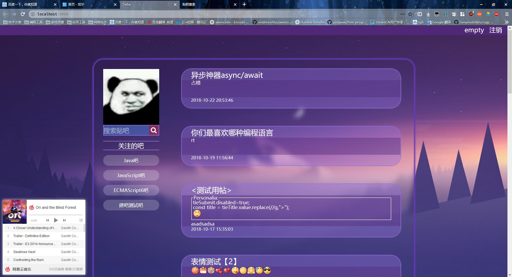
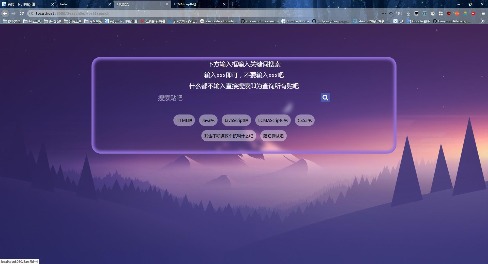
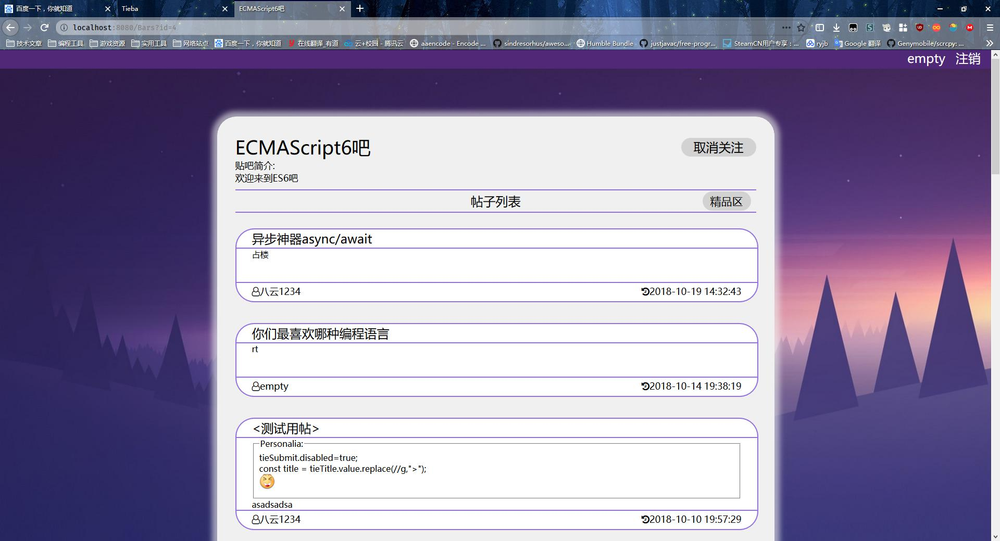
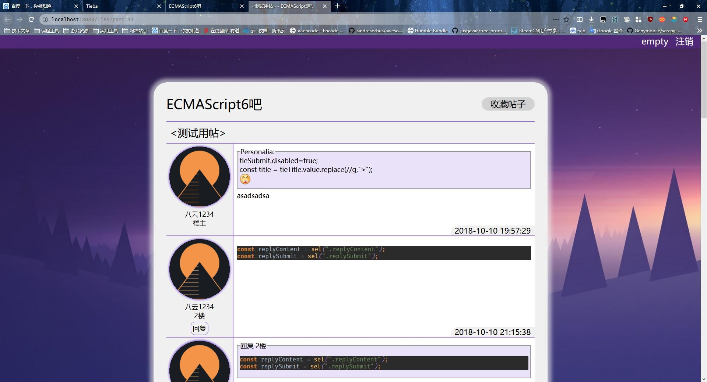
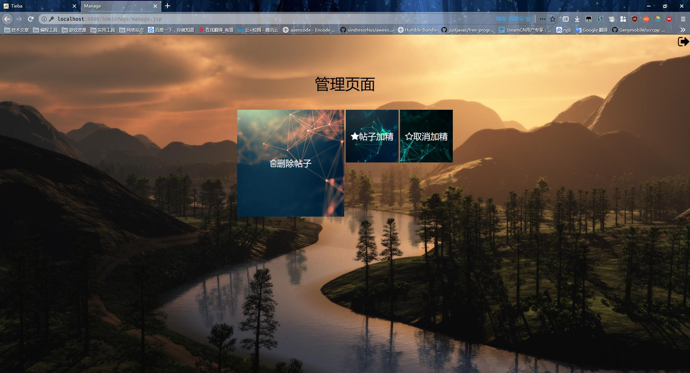
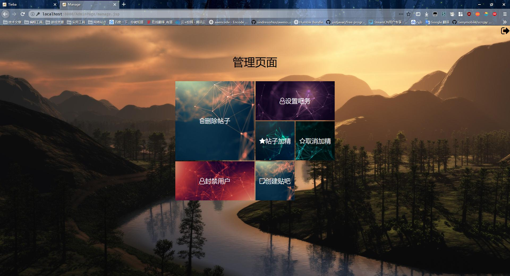

# Tieba
## 简述
　　贴吧是一个类似论坛的网络交流平台，用户可以通过发表主题帖来发起话题，其他用户可以通过在主题帖下面跟贴来进行讨论。  
　　此项目是在大二暑假期间(2018.6.10)起草，设计思路很大程度上借鉴于[百度贴吧](https://tieba.baidu.com/)。

## 网站构成
- 前端网页
  - JSP
  - CSS3
  - Javascript

- 后台服务
  - Java Servlet
  - MySQL 5.7

- 运行环境
  - JDK 8
  - Tomcat 9

- 第三方插件与第三方库
  - Cropper.js
    - 用作用户头像的裁剪与处理
  - Font Awesome
    - 用作网页的字体图标

## 截图展示
**首页**

**贴吧搜索页**

**浏览**

**看帖**

**管理页**

**该页面会根据账户等级(吧务/管理员)展示不同的功能**
